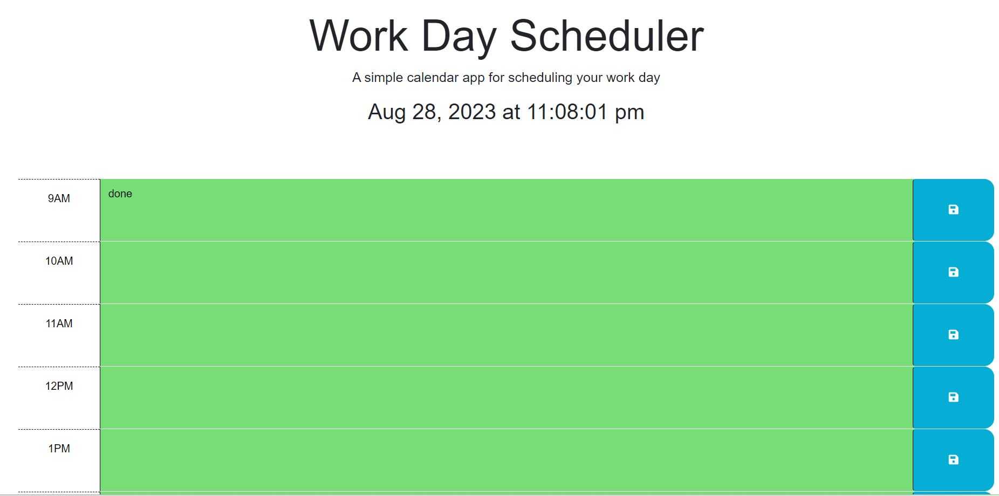

# daily-planner

## Description
Add important events to the calender to organize the day better.

## Usage
Add important events and details to text area and hit the save button to save them to local storage.

Based on the local time the calender the sort by color where Past will be in Gray, Present will be in Red and Future time will be in Green.

## Link to Website

## Screenshot of the website
